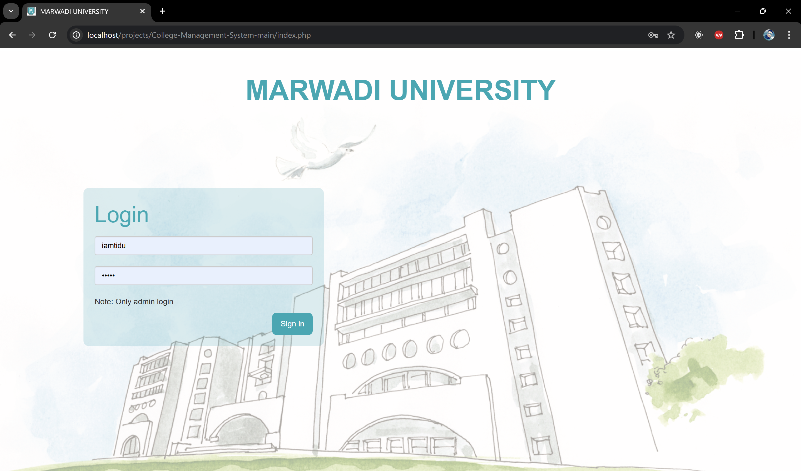
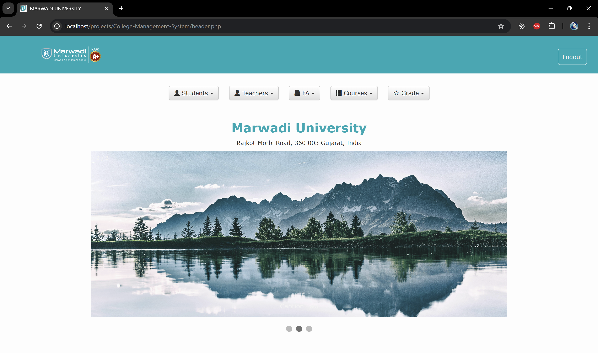
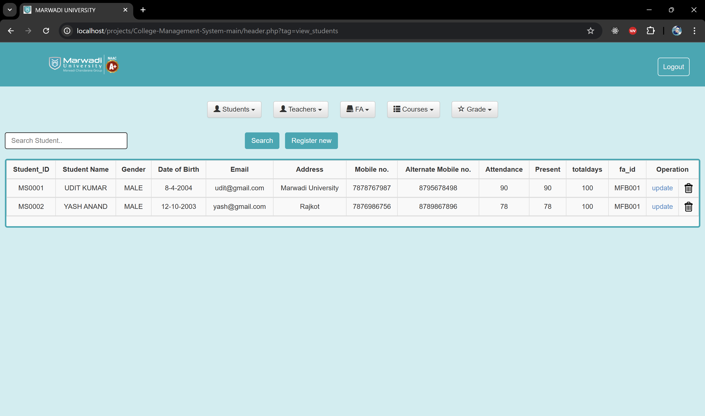
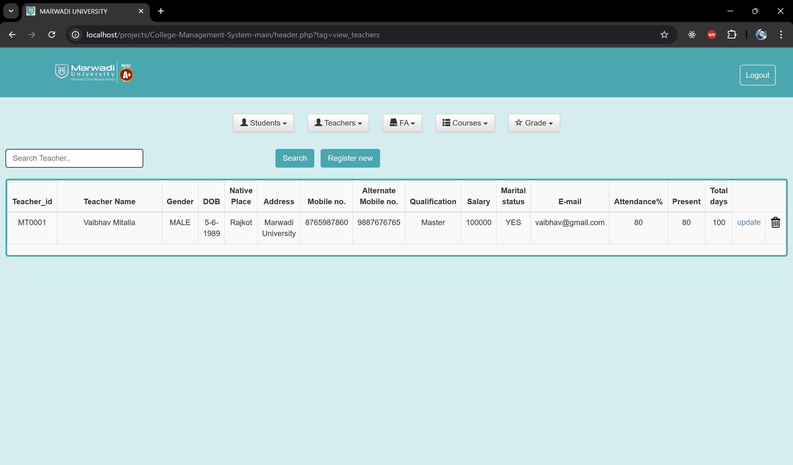

# College Management System
### using php

- HTML5 
- CSS3 
- JavaScript
- PHP
- MySql

## Outputs

## How To use

1. clone the project in the `htdocs` ( inside `c:\xampp`)
2. open Xampp and start Apache and Mysql Server 
3. make databse in Mysql (code inside: database.sql)
4. open Browser and search `localhost/project-directory`

## Bingo!!!